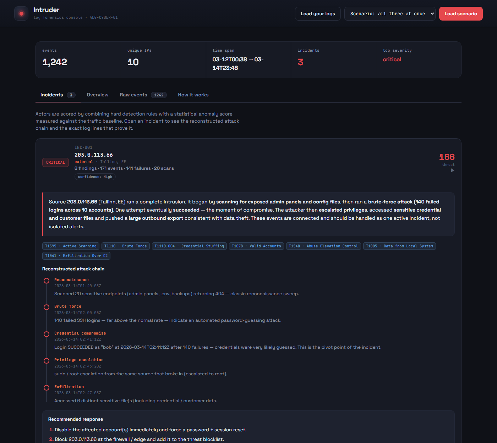

# Find the Intruder — ALG-CYBER-01

[](https://github.com/AnushreeKasturi/algothon/actions/workflows/tests.yml)


**▶ Live demo: https://anushreekasturi.github.io/algothon/** — runs entirely in your browser, no install.



A log-forensics / intrusion-detection system. It ingests security logs, scores
every source, correlates related events into a single **incident**, and
reconstructs the attacker's **kill chain** with evidence, MITRE ATT&CK mapping,
and recommended response actions — instead of emitting isolated alerts.

## Two parts

| folder | what it is | run it |
|--------|------------|--------|
| [`web/`](web/) | self-contained web console (the interactive demo) | [live demo](https://anushreekasturi.github.io/algothon/), or open `web/intruder.html` in a browser |
| [`python/`](python/) | the detection engine as a zero-dependency Python package + CLI | `cd python && python analyze.py --scenario all --report` |

Both share the same detection logic. The web console is the live demo; the
Python package is the backend and is easy to test and extend.

## What it detects

Reconnaissance (endpoint scanning), brute force, credential stuffing, the
success-after-failure **compromise pivot**, **impossible travel** (one account in
two places at once), privilege escalation, sensitive-file access, and data
exfiltration — fused per source into a scored incident with a timeline,
confidence rating, and MITRE techniques.

Three built-in scenarios (loud external breach, low-and-slow, malicious insider)
bury an attacker inside ~1,000 lines of normal traffic plus a benign decoy; a
correct run surfaces only the real attacker(s).

## Tests

```bash
cd python && python -m unittest -v
```

23 tests, run on every push via GitHub Actions (Python 3.9 and 3.12). They cover:
each scenario surfaces **exactly** the real attacker(s); the benign decoy and
internal hosts are never flagged; every finding carries log-line evidence;
parser edge cases (blank/garbage/short lines, loose `sshd`/web formats); and an
end-to-end CLI run (emit → re-ingest → JSON).

See [`python/README.md`](python/README.md) for the architecture diagram, the full
rule table, and the mapping to every ALG-CYBER-01 requirement.
