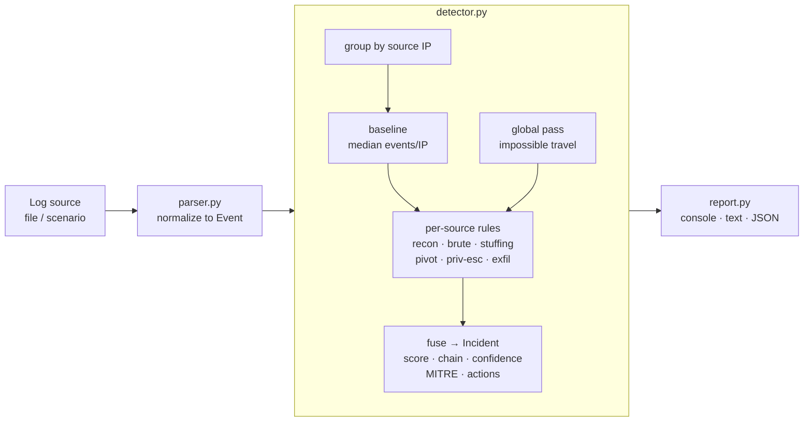

# Intruder — Find the Intruder (ALG-CYBER-01)

A log-forensics / intrusion-detection engine. It ingests security logs, scores
every source, correlates related events into a single **incident**, and
reconstructs the attacker's **kill chain** with evidence, MITRE ATT&CK mapping,
and recommended response actions — instead of emitting isolated, uncorrelated
alerts.

This is the Python backend. A companion single-file web console (`intruder.html`)
shares the same detection logic and is the interactive demo.

> **Zero dependencies.** Pure Python standard library — runs with any Python 3.9+.

---

## Quick start

```bash
cd intruder_py

# analyze a built-in attack scenario (no data needed)
python analyze.py --scenario external
python analyze.py --scenario all

# print the full incident report(s)
python analyze.py --scenario external --report

# analyze your own logs
python analyze.py path/to/auth.log

# write a sample log to disk, then feed it back in
python analyze.py --scenario lowslow --emit logs.txt
python analyze.py logs.txt

# machine-readable output for a SIEM / dashboard
python analyze.py --scenario all --json incidents.json
```

### Built-in scenarios

| scenario   | story                                                                 | caught by |
|------------|-----------------------------------------------------------------------|-----------|
| `external` | loud breach: recon → brute force → compromise → root → data theft     | volume + stuffing + pivot + priv-esc + exfil |
| `lowslow`  | failures thinned over hours across several accounts, quiet success    | credential stuffing + **impossible travel** + pivot |
| `insider`  | valid internal account, **no failed logins**, off-hours bulk export   | sensitive-file access + exfil + off-hours |
| `all`      | all three running at once                                             | ranked as three separate incidents |

Each scenario buries the attack inside ~1,000 lines of normal traffic plus a
benign decoy (a user mistyping her password). A correct run surfaces **only the
real attacker(s)** — the decoy and internal hosts are not flagged.

---

## Architecture



Plain-text view of the same flow:

```
 logs --> parser --> detector ------------------------------> report
                      |  group by IP                           |
                      |  learn baseline (median events/IP)     +- console summary
                      |  per-source rules   -\                 +- text incident report
                      |  impossible-travel  --+-> fuse ->       +- JSON
                      |  (cross-IP pass)    -/    Incident:
                      |                           score, kill-chain,
                      |                           confidence, MITRE,
                      |                           recommended actions
```

### Files

| file           | responsibility |
|----------------|----------------|
| `models.py`    | `Event`, `Finding`, `Incident` types; GeoIP + trust-class helpers; kill-chain stages |
| `generator.py` | seeded synthetic log generator with the three attack scenarios |
| `parser.py`    | canonical pipe-format parser + loose fallback for arbitrary logs |
| `detector.py`  | the detection engine (rules, correlation, scoring, narrative) |
| `report.py`    | console summary, plain-text incident report |
| `analyze.py`   | CLI that wires it all together |

The only coupling between stages is the `Event` record, so a new log source just
needs to emit `Event`s and the whole pipeline works unchanged.

---

## How detection works

**1. Normalize.** Every log line becomes an `Event(time, ip, user, action, result, detail)`.
`action ∈ {ssh, web, sudo, file}`, `result ∈ {OK, FAIL, SCAN}`.

**2. Baseline.** Events are grouped by source IP and the median events-per-source
is computed, so "anomalous" is defined relative to *this* environment, not a
hard-coded number.

**3. Layered rules** (each contributes to a threat score and a MITRE technique):

| signal | trigger | ATT&CK |
|--------|---------|--------|
| Reconnaissance | ≥6 requests to sensitive paths returning 404 | T1595 |
| Brute force | ≥20 failed SSH logins (≥8 = lower tier, flags "low & slow" spans) | T1110 |
| Credential stuffing | ≥4 usernames, ≥8 failures, **external** source | T1110.004 |
| Compromise pivot | a success after *attack-like* failures (multiple accounts / recon / huge volume) | T1078 |
| Impossible travel | one account authenticating from two locations ≤60 min apart | T1078 |
| Privilege escalation | sudo / root from a source that just broke in | T1548 |
| Sensitive file access | reads of credential / key / customer files (scales with breadth) | T1005 |
| Data exfiltration | large outbound transfer / bulk export | T1041 |
| Statistical anomaly | event volume ≥8× baseline, or >40% failure ratio | behavioral |

**4. Correlate.** All findings for one source are fused into a single `Incident`
with a de-duplicated, time-ordered **kill chain**, a **confidence** rating
(how many distinct stages corroborate), the **MITRE techniques** observed, and
**recommended response actions**.

### False-positive discipline

The rules are deliberately conservative, because that is what separates a usable
detector from a noisy one:

- A **single user** mistyping a password then logging in is *not* a compromise —
  the pivot rule requires attack-like failures (several accounts, preceding
  recon, or very high volume).
- **Internal** hosts legitimately see many users and occasional failures, so
  credential stuffing is gated to external sources with volume.
- The partner-VPN decoy and internal workstations produce **no incident** in any
  scenario.

---

## Input format

Canonical, one event per line:

```
ISO_TIME | SOURCE_IP | USER | ACTION | RESULT | DETAIL
2026-03-14T02:41:12Z | 203.0.113.66 | bob | ssh | OK | session opened
2026-03-14T09:02:51Z | 10.0.4.12 | alice | web | OK | GET /dashboard 200
```

Lines that don't match are handled by a best-effort parser that extracts a
timestamp + IP and infers the rest, so real-world auth/web logs still produce
usable events instead of failing.

---

## Mapping to the problem statement

| ALG-CYBER-01 requirement | where |
|--------------------------|-------|
| Log ingestion | `parser.py` (+ `generator.py` for demo data) |
| Anomaly detection / rules | `detector.py` rules + statistical baseline |
| Suspicious user / IP detection | per-source scoring → `Incident.severity` |
| Event grouping | correlation into one `Incident` per source |
| Incident timeline | `Incident.chain` (ordered kill chain) |
| Evidence | `Finding.evidence` — the exact log lines, in every report |
| **Bonus:** connect events + explain the attack sequence | `Incident.narrative` + kill chain + MITRE mapping |

### Common submission expectations

- **Deployed demo:** `intruder.html` (the web console) + this CLI.
- **Source + README:** this folder.
- **Architecture diagram + decisions:** above.
- **Core workflow demo:** `python analyze.py --scenario all --report`.
- **Testing / edge cases:** benign decoy stays unflagged; parser tolerates
  malformed lines; low-and-slow and insider paths exercise non-volume detection.
- **Known limitations / future work:** below.
- **AI-assisted components / external data:** none required; GeoIP is a stub.

---

## Extending it

- **Real GeoIP:** replace `geo_of()` / `GEO` in `models.py` with MaxMind
  GeoLite2 behind the same interface.
- **Real log formats:** add format-specific parsers that emit `Event`s
  (auth.log, Nginx/Apache access, CloudTrail, Windows Event Log).
- **More rules / ML:** the per-source feature set in `detector.analyze()` is a
  natural place to add an unsupervised anomaly model alongside the rules.
- **Streaming:** the engine is batch today; a sliding-window version would run
  the same rules over a rolling buffer.

## Limitations

- Synthetic GeoIP and a demo trust model (HQ + one partner VPN as anchors).
- Batch analysis, not real-time streaming.
- Thresholds are tuned for the demo's scale; a deployment would calibrate them
  from its own baseline.
